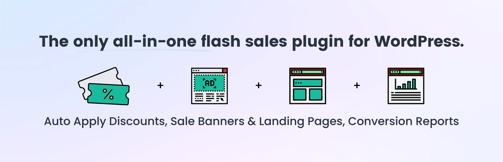

# [Sitewide Sales](https://sitewidesales.com) #

### Welcome to the Sitewide Sales GitHub Repository

For more information please visit [the Sitewide Sales website](https://sitewidesales.com)

## Installation ##
For detailed installation steps, visit the [documentation on getting started with the plugin](https://www.strangerstudios.com/wordpress-plugins/sitewide-sales/documentation/).

1. Download the current development ZIP file directly: `https://github.com/strangerstudios/sitewide-sales/archive/dev.zip`

**Please ensure that once installing this version of the plugin to remove `-dev` from the plugin's folder name.**

## Bugs ##
If you find an issue/bug, let us know by [creating a detailed GitHub issue](https://github.com/strangerstudios/sitewide-sales/issues/new/choose).

## Support ##
This is a developer's portal for Sitewide Sales. We do not offer support on this channel. **Any support related questions should be directed to [paidmembershipspro.com](https://www.paidmembershipspro.com).**

## Contributing to Sitewide Sales ##
We encourage and welcome any contribution to Sitewide Sales. Please read the [guidelines for contributing](https://github.com/strangerstudios/sitewide-sales/blob/dev/.github/CONTRIBUTING.md) to this repository.

There are various **ways to help the development** of Sitewide Sales:

1. Report [bugs/issues](https://github.com/strangerstudios/sitewide-sales/issues/new/choose) on GitHub.
2. Work on any issues by submitting a Pull Request.

Here are some ways for **non-developers to contribute** to Sitewide Sales:

1. Translate Sitewide Sales into your own language.
2. [Purchase Sitewide Sales](https://www.strangerstudios.com/account/checkout/?level=2) to help fund ongoing development and bug fixes.
